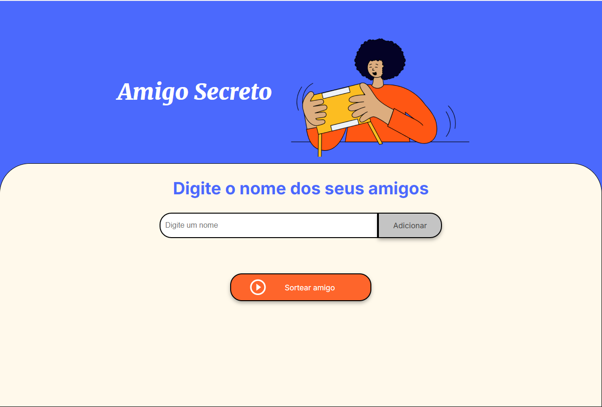
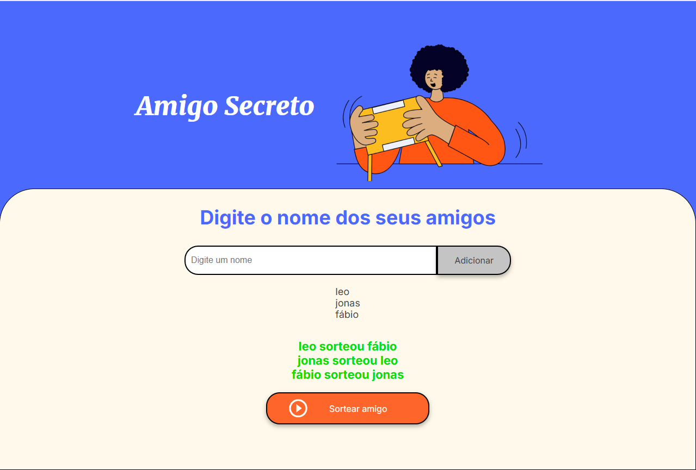

# Amigo Secreto

Projeto desenvolvido para realizar sorteios de amigo secreto de maneira simples e interativa, onde os usuários podem adicionar seus nomes e realizar o sorteio de forma aleatória.

## Funcionalidades

1. **Adicionar Nomes:**
   - O usuário pode inserir os nomes dos participantes no campo de texto.
   - Ao clicar no botão "Adicionar", o nome será incluído na lista de amigos.
   - Os nomes não podem ser duplicados, e o sistema alerta caso o nome já tenha sido adicionado.
2. **Sortear Amigo Secreto:**
   - Após adicionar pelo menos dois amigos, o usuário pode clicar no botão "Sortear Amigo" para realizar o sorteio de maneira aleatória.
   - O sorteio garante que ninguém sorteie a si mesmo.
   - O resultado é exibido na tela com o nome de cada amigo e o nome da pessoa que ele sorteou.

## Tecnologias Utilizadas

- **HTML5**: Estrutura da página.
- **CSS3**: Estilização da página.
- **JavaScript**: Lógica para adicionar nomes e realizar o sorteio aleatório.

## Como Usar

1. Abra o arquivo `index.html` em seu navegador.
2. Na página, você verá um campo de texto onde pode digitar o nome dos amigos.
3. Clique no botão "Adicionar" para adicionar os nomes à lista.
4. Após adicionar pelo menos 2 nomes, clique no botão "Sortear amigo" para realizar o sorteio.
5. O resultado será exibido logo abaixo, mostrando quem sorteou quem.

## Capturas de Tela

### Tela inicial

Na tela inicial, você pode adicionar nomes dos participantes e visualizar a lista à medida que os nomes são adicionados.

### Resultado do Sorteio

Após clicar no botão de sorteio, os resultados serão exibidos em uma lista mostrando quem cada amigo sorteou.

## Como Contribuir

1. Fork o repositório.
2. Crie uma branch para sua feature (`git checkout -b minha-feature`).
3. Faça as alterações necessárias.
4. Faça um commit das alterações (`git commit -am 'Adiciona nova funcionalidade'`).
5. Envie para o repositório remoto (`git push origin minha-feature`).
6. Crie um Pull Request.

## Licença

Este projeto está licenciado sob a MIT License - veja o arquivo [LICENSE](LICENSE) para mais detalhes.
